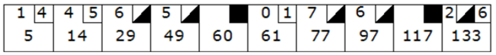

# Bowling Score calculator

Write a program that scores bowling.

## Scoring Rules
 
The game consists of 10 frames as shown below.  In each frame the player has two opportunities to knock down 10 pins.  The score for the frame is the total number of pins knocked down, plus any bonuses for strikes and spares.

A spare is when the player knocks down all 10 pins in two tries.  The bonus for that frame is the number of pins knocked down by the next roll.  So in frame 3 below, the score is 10 (the total number knocked down) plus a bonus of 5 (the number of pins knocked down on the next roll) for a total of 15.  

A strike is when the player knocks down all 10 pins on his first try.  The bonus for that frame is the value of the next two balls rolled.  So in frame 5 below, the score is 10 plus bonuses of 0 and 1 (the number of pins knocked down on the next two rolls) for a total of 11.

In the tenth frame a player who rolls a spare or strike is allowed to roll the extra balls to complete the frame.  However no more than three balls can be rolled in tenth frame, so any strikes in the bonus rolls do not also earn bonus rolls.

## Simplified Scoring Rules

1. **Game Structure**
   - Game consists of 10 frames
   - Each frame allows up to 2 rolls to knock down 10 pins
   - Frame score = pins knocked down + bonus points (if any)

2. **Spare** (/)
   - All 10 pins knocked down in 2 rolls
   - Bonus: Points from next roll
   - Example: Frame score = 10 + next roll

3. **Strike** (X)
   - All 10 pins knocked down in first roll
   - Bonus: Points from next two rolls
   - Example: Frame score = 10 + next two rolls

4. **Tenth Frame Special Rules**
   - Spare: One bonus roll allowed
   - Strike: Two bonus rolls allowed
   - Maximum three rolls total
   - Bonus rolls only count for points (no additional bonus rolls)